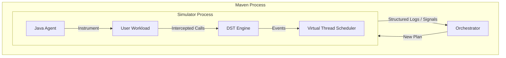

# OpenDST: User Guide

OpenDST is a Deterministic Simulation Testing (DST) framework for Java distributed systems. It allows you to run your entire system—multiple nodes, networking, filesystem, and threads—inside a controlled, discrete-event simulator where time is virtual and every execution is 100% reproducible.

---

## 1. Why Deterministic Simulation Testing?

### Traditional Testing vs. DST

| Feature | Example-based (Unit/Integration) | End-to-End (E2E) | **Deterministic Simulation (DST)** |
| :--- | :--- | :--- | :--- |
| **Execution** | Local / Isolated | Real Cluster / Docker | **Simulated / Virtual** |
| **Determinism** | High (usually) | Low (Flaky) | **Absolute (100% reproducible)** |
| **Time** | Wall-clock (Slow) | Wall-clock (Slow) | **Virtual (Instant)** |
| **Fault Injection** | Mocks (Manual) | Network Emulators (Complex) | **Native & Automatic** |
| **State Exploration** | Fixed paths | Limited | **Deep & Guided** |

### Key Benefits
1.  **Eliminate Flakiness**: Race conditions, timeouts, and network hiccups are no longer random. If a bug is found with seed `12345`, it will happen every single time you run with that seed.
2.  **Time Travel**: You can simulate hours of system activity in seconds. `Thread.sleep(Duration.ofDays(1))` returns instantly because virtual time simply jumps forward to the next scheduled event.
3.  **Perfect Fault Injection**: OpenDST can simulate network partitions, connection resets, and filesystem I/O errors at the exact moment they are most likely to trigger a bug.
4.  **Deep State Exploration**: By using **Signals**, the orchestrator learns which execution paths lead to "interesting" states and prioritizes exploration around them.

---

## 2. Architecture Overview

OpenDST runs as a specialized environment that wraps your application.

*   **JVM & Agent**: Your code runs on a standard JVM, but with the `SimulatorAgent` attached. This agent instruments non-deterministic JDK APIs (Time, Random, Threads, Sockets, Files) and redirects them to the Simulator.
*   **Simulator**: The discrete-event engine. It manages a priority queue of tasks, handles virtual thread scheduling, and simulates I/O.
*   **Workload**: Your actual application code, typically packaged as a JAR or WAR.
*   **Orchestrator**: The "brain" outside the simulator. It decides which **Seeds** and **Plans** to run, monitors for signals, and saves "interesting" plans (failures or new coverage).



---

## 3. Building and Deploying

OpenDST is designed to test real deployments. The standard way to provide your application to the simulator is via a **WAR** (Web Application Archive) or a simple directory of classes.

### Project Structure
A typical DST project uses the `opendst-maven-plugin`. Your application logic resides in `src/main`, and your DST scenarios reside in `src/test`.

### Packaging as a WAR
In your `pom.xml`, configure the `maven-war-plugin` to create an exploded WAR:

```xml
<plugin>
    <groupId>org.apache.maven.plugins</groupId>
    <artifactId>maven-war-plugin</artifactId>
    <version>3.4.0</version>
    <configuration>
        <failOnMissingWebXml>false</failOnMissingWebXml>
        <webappDirectory>${project.build.directory}/wars/${project.artifactId}</webappDirectory>
    </configuration>
</plugin>
```

The simulator will use the content of `WEB-INF/classes` and `WEB-INF/lib` from this directory to populate the classpath of the simulated nodes.

---

## 4. Bug Hunting with Signals and Log Monitors

### Using Signals (The SDK)
The `opendst-sdk` provides a way for your code to communicate with the orchestrator.

*   **`Signals.ready()`**: Call this once your node has finished initialization. Fault injection (latency, partitions) only starts after this signal.
*   **`Assert.reachable(message, details)`**: Tells the orchestrator: "I've reached this point!". The orchestrator will try to branch from this moment to explore further.
*   **`Assert.always(condition, message, details)`**: A "Passive" invariant. If the condition is false, the simulation fails immediately.

```java
// Example from Server.java
if (code == SECRET_SEQUENCE[currentLevel]) {
    currentLevel++;
    if (currentLevel == 1) Assert.reachable("level_1", null); // Help the orchestrator find the next level
    if (currentLevel == 2) Assert.reachable("level_2", null);
    if (currentLevel == 3) Assert.reachable("level_3", null);
    
    if (currentLevel == SECRET_SEQUENCE.length) {
        Assert.always(checkState(), "safety_invariant", null); // Assert system safety
    }
}
```

### The Log Monitor
You can define custom "Property Checkers" by implementing the `LogMonitor` interface on your DST class. This allows you to detect bugs by observing the logs of all nodes in real time.

```java
public class MyDST implements LogMonitor {
    public void run() throws IOException {
        startNode("server", "10.0.0.1", this::server);
        startNode("client", "10.0.0.2", this::client);
    }

    @Override
    public void process(Log log) throws Throwable {
        // Fail if any node logs an error
        if (log.message().contains("ERROR")) {
            throw new AssertionError("Observed error in logs: " + log.message());
        }
    }
}
```

### Quick Interrupt on Discovery
In OpenDST, throwing an `AssertionError` (either in the test or the `LogMonitor`) is the preferred way to **instantly stop** the simulation. The orchestrator catches this, identifies the run as a "discovery," and saves the exact `Plan` (seed and sequence of events) to `target/opendst/<testName>/failures/` for instant replay.

---

## 5. Running the Simulation

Use the Maven plugin to start the exploration:

```bash
# Run all DST tests
mvn verify

# Run a specific DST test
mvn verify -Dopendst.test=MySystemDST

# Replay a specific failing plan
mvn verify -Dopendst.test=<testName> -Dopendst.plan=target/opendst/<testName>/failures/failure-0.json
```
